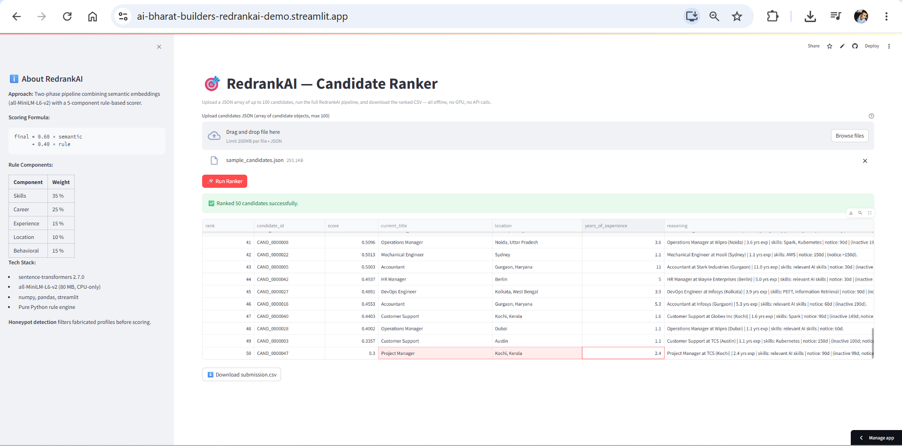

# 🎯 RedrankAI — Intelligent Candidate Discovery & Ranking System

---

> 🏆 **Redrob AI INDIA.RUNS Hackathon Submission**
>
> | | |
> |---|---|
> | 🏷️ **Submission Name** | RedrankAI — Intelligent Candidate Discovery & Ranking System |
> | 🤝 **Team** | AI Bharat Builders |
> | 👤 **Lead** | Ritesh Raut |
> | 🎨 **Theme** | Data & AI Challenge: Intelligent Candidate Discovery |
> | 🧩 **Problem Statement** | Intelligent Candidate Discovery & Ranking System — rank 100,000 candidates against a job description the way a great recruiter would |

---


> 🚀 **Ranks 100,000 candidates against a Senior AI Engineer job description using semantic embeddings + rule-based scoring — fully offline, no GPU, no API calls.**

---

## 🧩 The Problem

Traditional Applicant Tracking Systems (ATS) match candidates to job descriptions by keyword overlap. This creates three compounding failures:

1. **Keyword stuffers win.** A candidate who lists "FAISS, Pinecone, Qdrant, Weaviate, Milvus, OpenSearch" in their skills section ranks above someone who built and shipped a production vector search system but described it as "nearest-neighbour retrieval at scale."
2. **Inactive candidates pollute the top.** A perfectly-matched résumé from someone who hasn't been active on the platform in eight months wastes a recruiter call.
3. **IT-services tenure is overweighted.** A decade at TCS doing IT support looks identical to a decade of product-company AI engineering in a keyword count.

**RedrankAI solves all three.** Semantic embeddings match meaning. Rule-based scoring weights real demonstrated skill (endorsements × usage months), penalises IT-services-only careers, and uses 23 behavioural signals as a real-time availability multiplier. Honeypot detection removes fabricated profiles before scoring begins.

---

## 🏗️ Our Approach

### Two-Phase Architecture

**Phase 1 — Offline Precompute (~15 min, run once)**

The job description and all 100K candidate summaries are encoded with `all-MiniLM-L6-v2` (80 MB, CPU-only). Outputs are three `.npy` files saved to disk. This phase is never timed — run it once, reuse forever.

**Phase 2 — Timed Ranking (<2 min)**

`rank.py` loads the `.npy` files, computes vectorised cosine similarity in NumPy (100K dot products in under 1 second), streams `candidates.jsonl` (or `.jsonl.gz`), filters honeypots, and for each surviving candidate blends a semantic score with a 5-component rule score:

```
final_score = 0.60 × cosine_similarity
            + 0.40 × (
                0.35 × skill_score
              + 0.25 × career_score
              + 0.15 × experience_score
              + 0.10 × location_score
              + 0.15 × behavioral_score
            )
```

The top 100 scores are normalised to `[0.30, 0.99]` non-increasing. Ties are broken by `candidate_id` ascending (as required by the validator).

### Why `all-MiniLM-L6-v2`?

- **80 MB model** — fits in any 16 GB RAM constraint with headroom
- **384-dim embeddings** — fast cosine computation over 100K vectors
- **Excellent sentence-level semantics** — purpose-built for semantic similarity, not generation
- **CPU-efficient** — no GPU required; encodes 100K summaries in ~12 min on a modern CPU
- **Offline-capable** — saved to `./model`, zero network calls during ranking

---

## 📁 Repo Structure

```
ai-bharat-builders-redrankAI/               ← GitHub repo root
├── README.md                               # This file
├── LICENSE                                 # MIT License
├── requirements.txt                        # Root-level deps for Streamlit Cloud deployment
├── submission_metadata.yaml                # Team identity, compute specs, AI tools declaration (repo root — required by spec)
├── .gitignore                              # Excludes candidates.jsonl, __pycache__, .venv
├── .gitattributes                          # Git LFS tracking for *.npy files
├── assets/
│   └── screenshot.png                     # Live demo screenshot
├── ai-bharat-builders-redrankAI/           # Source code folder
│   ├── precompute.py                       # Phase 1: encode JD + all 100K candidates → .npy files
│   ├── rank.py                             # Phase 2: load .npy, score, blend, write submission.csv
│   ├── scorer.py                           # Five pure scoring functions (skill/career/exp/loc/behavioral)
│   ├── honeypot.py                         # Honeypot detection — filters fabricated profiles
│   ├── app.py                              # Streamlit sandbox (upload JSON → rank → download CSV)
│   ├── convert_to_xlsx.py                  # Convert submission.csv → formatted submission.xlsx
│   ├── requirements.txt                    # Core pipeline deps (rank.py + precompute.py)
│   ├── Dockerfile                          # CPU-only Docker image for reproducible ranking
│   └── test_data/                          # Hackathon-provided datasets + test scripts
│       ├── sample_candidates.json          # 50 sample candidate profiles (from hackathon)
│       ├── sample_submission.csv           # Reference valid submission format (from hackathon)
│       ├── candidate_schema.json           # Full candidate field schema (from hackathon)
│       ├── job_description.docx            # Official JD for Senior AI Engineer (from hackathon)
│       ├── redrob_signals_doc.docx         # Signals field reference doc (from hackathon)
│       ├── submission_spec.docx            # Full submission specification (from hackathon)
│       ├── validate_submission.py          # Official validator script (from hackathon)
│       └── test_pipeline.py               # End-to-end smoke test (no model/GPU required)
```

---

## ⚡ Quick Start

### 1. Clone the repo

```bash
git clone https://github.com/Riteshraut0116/ai-bharat-builders-redrankAI.git
cd ai-bharat-builders-redrankAI
```

### 2. Navigate into the source folder

```bash
cd ai-bharat-builders-redrankAI
```

### 3. Create and activate a virtual environment

```bash
python -m venv .venv
.venv\Scripts\activate        # Windows
# source .venv/bin/activate   # Mac/Linux
```

### 4. Install PyTorch (CPU-only)

**Windows:**
```bash
pip install torch==2.3.1+cpu --index-url https://download.pytorch.org/whl/cpu
```
**Mac / Linux:**
```bash
pip install torch
```

### 5. Install remaining dependencies

```bash
pip install -r requirements.txt
```

### 6. Copy the dataset into the source folder

Copy `candidates.jsonl` (provided by hackathon) into the current folder:
```bash
# Windows
copy "C:\path\to\candidates.jsonl" .

# Mac/Linux
cp /path/to/candidates.jsonl .
```

### 7. Download and save the model locally *(needs internet, one time only)*

```python
from sentence_transformers import SentenceTransformer
model = SentenceTransformer("all-MiniLM-L6-v2")
model.save("./model")
print("Model saved to ./model")
```
> After this step, turn WiFi off — everything below is fully offline.

### 8. Run precompute *(once, ~15 min, offline)*

```bash
python precompute.py \
    --candidates ./candidates.jsonl \
    --model ./model \
    --out ./
```

Expected output:
```
INFO Loaded 100000 candidates (0 parse errors)
INFO Total time: ~900 seconds (~15 minutes)
```
Produces: `embeddings.npy`, `candidate_ids.npy`, `jd_embedding.npy`

### 9. Run the ranker *(<2 min, offline)*

```bash
python rank.py \
    --candidates ./candidates.jsonl \
    --embeddings ./embeddings.npy \
    --ids ./candidate_ids.npy \
    --jd ./jd_embedding.npy \
    --out ./submission.csv
```

Expected output:
```
INFO Loaded embeddings shape=(100000, 384)
INFO Scoring done: 99XXX scored, X honeypots filtered
INFO Done. Total time: ~90 seconds
```

### 10. Validate the output

```bash
python test_data/validate_submission.py submission.csv
```

Expected output:
```
Submission is valid.
```

### 11. Convert to XLSX for portal upload

```bash
python convert_to_xlsx.py --input ./submission.csv --output ./submission.xlsx
```

Expected output:
```
INFO Saved submission.xlsx (100 rows)
```

### 12. (Optional) Run smoke test without full dataset

```bash
python test_data/test_pipeline.py
```

Expected output:
```
Loading sample candidates ...
Loaded 50 candidates from sample_candidates.json

Running scorer tests ...
  All scorer tests passed.
Running honeypot detection test ...
  Honeypot detection passed. (0 flagged out of 50)
Running ranking pipeline test ...
  Ranking pipeline passed — 50 rows, non-increasing scores, unique IDs.

  validate_submission skipped (needs exactly 100 rows).

All tests passed! [OK]
```

---

## 📊 Scoring Formula

```
final_score = 0.60 × semantic_similarity
            + 0.40 × rule_score

rule_score  = 0.35 × skill_score
            + 0.25 × career_score
            + 0.15 × experience_score
            + 0.10 × location_score
            + 0.15 × behavioral_score
```

### Component Breakdown

| Component | Rule Weight | Effective Weight | Key Fields Used |
|-----------|-------------|-----------------|-----------------|
| **Semantic Similarity** | — | 60% | `profile.headline`, `profile.summary`, `current_title`, top 8 skills by endorsements, first 3 career entries |
| **Skill Score** | 35% | 14% | `skills[].name`, `.proficiency`, `.endorsements`, `.duration_months`, `redrob_signals.skill_assessment_scores` |
| **Career Score** | 25% | 10% | `career_history[].company`, `.title`, `.duration_months`, `.description` |
| **Experience Score** | 15% | 6% | `profile.years_of_experience` |
| **Location Score** | 10% | 4% | `profile.location`, `profile.country`, `redrob_signals.willing_to_relocate`, `redrob_signals.notice_period_days` |
| **Behavioral Score** | 15% | 6% | 23 `redrob_signals` fields (see below) |

#### 🔬 Skill Score Detail

Each matching skill contributes:
```
proficiency_mult × max(0.3, (endorsements/50 + duration_months/60) / 2) × base_weight
```
- **MUST_HAVE_SKILLS** (embeddings, vector search, FAISS, RAG, NDCG, Python, NLP, LLM…): `base_weight = 1.0`
- **GOOD_SKILLS** (LoRA, QLoRA, PyTorch, Docker, Kubernetes, AWS…): `base_weight = 0.5`
- Proficiency multipliers: `expert=1.0`, `advanced=0.8`, `intermediate=0.5`, `beginner=0.2`
- Bonus: up to `+0.10` from `skill_assessment_scores` for relevant skills

#### 🏢 Career Score Detail

- Base = `0.4 + product_tenure_ratio × 0.4`
- Production keyword bonus: `+up to 0.2` (keywords: `production`, `deployed`, `shipped`, `scale`, `A/B test`, `ranking`, `retrieval`, `embedding`, `vector`)
- **Penalty: services ratio > 90%** of career → `-0.40`
- **Penalty: services ratio > 50%** of career → `-0.20`  *(services = TCS, Infosys, Wipro, Cognizant, Accenture, Capgemini, HCL, Tech Mahindra, Mphasis, Hexaware)*
- **Penalty: research-only titles > 80%** of career → `-0.30`
- **Penalty: > 3 jobs under 12 months** → `-0.15` (+ `-0.05` per extra)
- **Bonus: senior/lead/staff/principal/architect** in current title → `+0.15`

#### 📅 Experience Score Detail

| Years of Experience | Score |
|---------------------|-------|
| < 3 | 0.10 |
| 3 – 5 (JD_YOE_MIN) | Linear 0.40 → 0.80 |
| 5 – 9 (JD sweet spot) | 0.80 – 1.00 (peak at 7 yrs) |
| > 9 | Decay 0.04/yr, floor 0.40 |

#### 📍 Location Score Detail

| Location | Score |
|----------|-------|
| Preferred city (Pune/Noida/Bangalore/Hyderabad/Mumbai/Delhi/Gurgaon/Chennai) | 1.0 |
| India, willing to relocate | 0.5 |
| India, not willing to relocate | 0.3 |
| Outside India | 0.1 |

Notice modifier: ≤30d → ×1.0 | ≤60d → ×0.9 | ≤90d → ×0.8 | >90d → ×0.6

#### 🧠 Behavioral Score Detail

```
0.25 × activity_score           (recency of last_active_date)
+ 0.10 × open_to_work_flag
+ 0.20 × recruiter_response_rate
+ 0.15 × interview_completion_rate
+ 0.10 × offer_acceptance_rate  (–1 → neutral 0.5)
+ 0.10 × github_activity / 100  (–1 → 0)
+ 0.05 × profile_completeness / 100
+ 0.05 × (verified_email + verified_phone + linkedin_connected) / 3
```

Activity bands: < 30 days → 1.0 | < 90 days → 0.7 | < 180 days → 0.4 | else → 0.1

---

## 🗂️ Candidate Data Used

### `profile`
| Field | How Used |
|-------|----------|
| `headline` | Primary text in embedding summary |
| `summary` | First 300 chars in embedding summary |
| `current_title` | Career score seniority bonus; embedding; reasoning |
| `current_company` | Embedding summary |
| `location` | Location score city matching |
| `country` | Location score India check |
| `years_of_experience` | Experience score bands |

### `skills[]`
| Field | How Used |
|-------|----------|
| `name` | Substring-matched against MUST_HAVE_SKILLS and GOOD_SKILLS |
| `proficiency` | Multiplier (expert/advanced/intermediate/beginner) |
| `endorsements` | Trust weight (cap 50) in skill score |
| `duration_months` | Trust weight (cap 60) in skill score; honeypot detection |

### `career_history[]`
| Field | How Used |
|-------|----------|
| `company` | Services firm detection |
| `title` | Research-only detection; embedding summary |
| `duration_months` | Services/research ratio; job-hopping penalty |
| `is_current` | Embedding context |
| `description` | Production keyword scan for career score bonus |

### `education[]`
| Field | How Used |
|-------|----------|
| `degree`, `field_of_study`, `institution`, `tier` | Embedding summary context |

### `redrob_signals`
| Field | How Used |
|-------|----------|
| `last_active_date` | Activity score in behavioral score |
| `open_to_work_flag` | Direct weight in behavioral score |
| `recruiter_response_rate` | Highest-weight behavioral signal (0.20) |
| `interview_completion_rate` | Behavioral score |
| `offer_acceptance_rate` | Behavioral score (–1 → neutral 0.5) |
| `github_activity_score` | Behavioral score (–1 → 0) |
| `profile_completeness_score` | Behavioral score; honeypot detection |
| `skill_assessment_scores` | Bonus to skill score for verified skills |
| `notice_period_days` | Location score notice modifier; reasoning flags |
| `willing_to_relocate` | Location score fallback |
| `verified_email`, `verified_phone`, `linkedin_connected` | Verification signal in behavioral score |

---

## 🕵️ Honeypot Detection

`honeypot.py` flags a profile as fabricated if **any one** of these conditions is true:

| # | Condition | Rationale |
|---|-----------|-----------|
| 1 | ≥ 8 skills with `proficiency == "expert"` AND `endorsements == 0` | No one who is genuinely expert in 8+ skills has zero social proof |
| 2 | `profile_completeness == 100` AND ≥ 15 `expert` skills | Statistically impossible for a real profile |
| 3 | ≥ 6 skills with `proficiency == "expert"` AND `duration_months == 0` AND `endorsements == 0` | Claimed expertise with zero usage history and zero endorsements |
| 4 | `years_of_experience > 35` | Exceeds realistic career length for the role |

Flagged profiles are excluded from ranking entirely.

---

## 🖥️ Sandbox

**Live Demo:** [https://ai-bharat-builders-redrankai-demo.streamlit.app](https://ai-bharat-builders-redrankai-demo.streamlit.app)



### How to use the sandbox:
1. Go to [ai-bharat-builders-redrankai-demo.streamlit.app](https://ai-bharat-builders-redrankai-demo.streamlit.app)
2. Upload `test_data/sample_candidates.json` from this repo
3. Click **🚀 Run Ranker**
4. View ranked results with scores, titles, locations and reasoning
5. Click **⬇️ Download submission.csv** to export

### Run locally

```bash
pip install -r requirements-sandbox.txt
streamlit run app.py
```

Then open `http://localhost:8501`, upload a JSON array of candidates (max 100), click **Run Ranker**, and download the result CSV.

---

## 📦 Git LFS for Large Files

The `embeddings.npy` file (~150 MB for 100K × 384 float32) exceeds GitHub's 100 MB limit. Use Git LFS:

```bash
# Install Git LFS (once per machine)
git lfs install

# Track .npy files (already in .gitattributes)
git lfs track "*.npy"

# Add and commit normally
git add .gitattributes embeddings.npy candidate_ids.npy jd_embedding.npy
git commit -m "Add precomputed embeddings via LFS"
git push origin main
```

The `.gitattributes` file in this repo already contains:
```
*.npy filter=lfs diff=lfs merge=lfs -text
```

---

## 🐳 Docker

### Build

```bash
docker build -t redrankai ai-bharat-builders-redrankAI/
```

### Run

Mount the directory containing your data files to `/data` and an output folder to `/out`:

```bash
# Linux / Mac
docker run --rm \
  -v $(pwd):/data:ro \
  -v $(pwd)/docker_out:/out \
  redrankai

# Windows PowerShell
docker run --rm `
  -v "${PWD}:/data:ro" `
  -v "${PWD}/docker_out:/out" `
  redrankai
```

Output `submission.csv` will appear in `docker_out/`.

---

## 💻 Compute Requirements

| Requirement | Value |
|-------------|-------|
| Python version | 3.11 |
| RAM | 16 GB |
| CPU cores | 8 (4+ recommended) |
| GPU required | ❌ No |
| Network during ranking | ❌ No |
| Precompute time (100K) | ~15 minutes |
| Ranking time (100K) | < 2 minutes |
| Model size | ~80 MB (all-MiniLM-L6-v2) |
| Peak RAM during ranking | < 4 GB |

---

## 👥 Team Details

| | |
|--|--|
| **Team Name** | AI Bharat Builders |
| **Challenge** | Redrob India Runs Hackathon — Data & AI Challenge |
| **Problem Statement** | Intelligent Candidate Discovery & Ranking System |

| Member | Role |
|--------|------|
| Ritesh Raut | Team Lead / AI Engineer |
| Tasarun Nasreen | AI Engineer |

---

## 🤖 AI Tools Declaration

| Tool | How Used |
|------|----------|
| `sentence-transformers` (HuggingFace) | `all-MiniLM-L6-v2` model for offline semantic embeddings |
| Claude (Anthropic) | Code review and architectural discussion during development |

All scoring logic, rule design, JD signal analysis, and engineering decisions are **human-authored**. No candidate data was fed to any LLM or external API at any stage.

---

## 🎬 Demo Video

> 📽️ Watch RedrankAI rank 100K candidates live — precompute phase, scoring pipeline, and the Streamlit sandbox in action.

**Demo Video:** *(link to be added)*

### What the demo covers:
1. **⚙️ Precompute phase** — encoding 100K candidate summaries with `all-MiniLM-L6-v2` into `.npy` files
2. **🏃 Ranking phase** — `rank.py` streaming candidates, blending semantic + rule scores, producing `submission.csv` in under 2 minutes
3. **✅ Validation** — `validate_submission.py` confirming zero errors on the output
4. **🖥️ Streamlit sandbox** — uploading a sample JSON, viewing ranked results, downloading CSV
5. **📊 Score distribution** — walkthrough of why the top candidates were ranked where they were

---

## 📄 License

MIT License — see [LICENSE](LICENSE) for details.

```
Copyright (c) 2026 AI Bharat Builders
```
---

## 👤 Author

**Ritesh Raut**  
*Asoociate, Cognizant*

AI-powered decision copilot for Bharat’s MSME sellers 📊🤖

---

### 🌐 Connect with me:
<p align="left">
<a href="https://github.com/Riteshraut0116" target="blank"></a>
<a href="https://linkedin.com/in/ritesh-raut-9aa4b71ba" target="blank"></a>
<a href="https://www.instagram.com/riteshraut1601/" target="blank"></a>
<a href="https://www.facebook.com/ritesh.raut.649321/" target="blank"></a>
</p>

---

> 🎯 **RedrankAI** — *Rank smarter. Hire faster. No keyword traps.* 🇮🇳🤖✨
>
> Built with ❤️ by **AI Bharat Builders** for the Redrob India Runs Hackathon — Data & AI Challenge

---